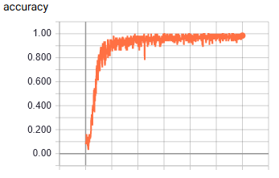
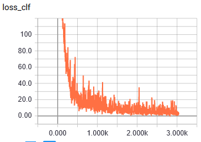
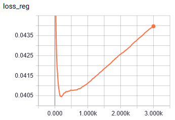

# test.NINH

reimplement the network architecture of **NINH**[1] in TensorFlow,
testing with MNIST classification.

# Environment

- tensorflow 1.12.0
- cuda 9.0

# Data

MNIST, zooming into [224, 224, 3].

# Usage

- `python main.py`
- `tensorboard --logdir log`

# Result

- iter 0: 0.089
- iter 100: 0.233
- iter 550: 0.9
- iter 2950: 0.98

# References

1. [Simultaneous Feature Learning and Hash Coding with Deep Neural Networks Hanjiang](https://www.cv-foundation.org/openaccess/content_cvpr_2015/html/Lai_Simultaneous_Feature_Learning_2015_CVPR_paper.html)
2. [HYPJUDY/caffe-dnnh](https://github.com/HYPJUDY/caffe-dnnh)
